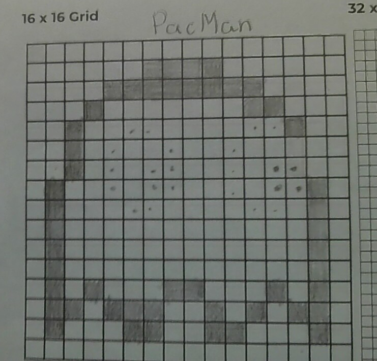
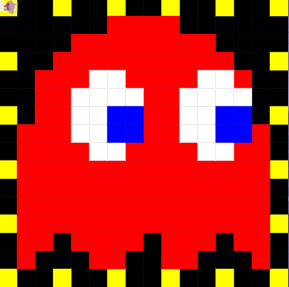

# Unit 1 - Asphalt Art

## Introduction

Cities use asphalt art to improve public safety, inspire their residents and visitors, and brighten communities. Your goal is to create asphalt art to revitalize The Neighborhood and bring the community together with the help of the Painter.

## Requirements

Use your knowledge of object-oriented programming, algorithms, the problem solving process, and decomposition strategies to create asphalt art:
- **Create a new subclass** – Create at least one new subclass of the PainterPlus class that is used for a component of the asphalt art design.
- **Plan an algorithm** – Use the problem solving process and decomposition strategies to plan an algorithm that incorporates a combination of sequencing, selection, and/or iteration.
- **Write a method** – Write at least one method in a PainterPlus subclass that contributes to a component of the asphalt art design.
- **Document your code** – Use comments to explain the purpose of the methods and code segments.

## Notes: Neighborhood & Painter Class

This project was created on Code.org's JavaLab platform using the built in Neightborhood GUI output. To test and edit this project you must build in Code.org's JavaLab with the Neighborhood GUI enabled. For reference to the Painter class documentation, [you can read more here.](https://studio.code.org/docs/ide/javalab/classes/Painter)

## Output:

### Starting Draft

### Final Draft (Color)

## Reflection

1. Describe your project.

   - In this project, you are required to pick a starting grid. Either 12 by 12, 16 by 16, or 32 by 32. Then, you are needed to create a pixel art through inspiration. For me, I picked pacman since as a kid, I used to stay up playing it with my dad which is the reason why I am so close to this till this day. I used methods and subclasses to help contribute to the whole desing of the pacman. 

2. What are two things about your project that you are proud of?

   - Two things that I am really proud of in my project was the colors. I believe it looks awesome and very neat. Another thing I am very proud, which is honestly weird, is the comments. I learned how to do those long comments and it makes my code look more fancy and proffesional. I know I probably sound dumb but I am proud that I was able to use that.

3. Describe something you would improve or do differently if you had an opportunity to change something about your project.

   - The main thing that I would change in my program would be adding arguments such as string color and int spaces. This would make my code more  simple yet efficient. I would have to change the design of my pixel art since their arent a lot of repetitive things except for the yellow dots and background.